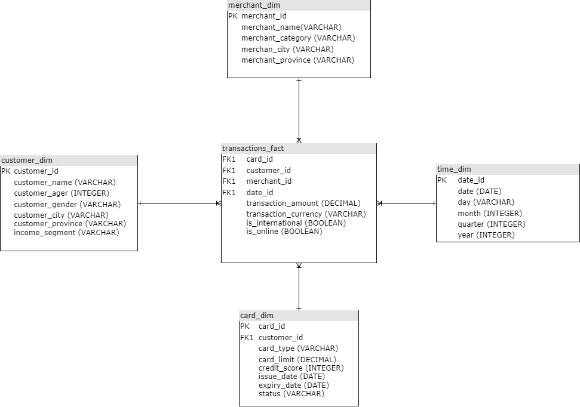

## Modelo Dimensional - Esquema Estrella

Se propone el siguiente modelo, usando un esquema en estrella para el desafío planteado: 

### Tablas de Hechos y Dimensiones

-   transactions_fact

    **Granularidad:** Una fila por cada transacción con tarjeta de crédito.

    **Estrategia de actualización:** Carga incremental diaria desde lafuente. No se actualizan registros históricos.

-   customer_dim

    **Granularidad:** Un registro por cliente

    **Estrategia de actualización:** SCD Tipo 2 (Histórico de cambios en segmento de ingresos y ubicación)

-   card_dim

    **Granularidad:** Un registro tarjeta de crédito de cliente.

    **Estrategia de actualización:** SCD Tipo 1 para cambios en estado y límite de crédito.

-   merchant_dim

    **Granularidad:** Un registro por comercio.

    **Estrategia de actualización:** SCD Tipo 1, actualizacion mensual

### Implementación de modelo usando arquitectura Medallion

#### Bronze Layer

-   Esta capa almacenará datos en crudo de cada fuente en formato Delta Lake.
-   Se mantiene el esquema original de los datos y su ingesta será incremental.
-   Las actualizaciones tendrán una frecuencias diarias (transacciones y tarjetas), semanales (clientes) y mensuales (comercio).
-   El particionamiento será dado por la fecha de ingesta.

#### Silver Layer

-   Esta capa se realizarán normalizaciones y limpieza de datos.
-   Se aplicarán filtrado de duplicados y datos inconsistentes. Se realizacón conversiones de formatos para las fechas
-   Las actualizaciones tendrán una frecuencias diarias (transacciones y tarjetas), semanales (clientes) y mensuales (comercio).
-   El particionamiento diferirá por tablas: transactions_fact por transaction_date, customer_dim por customer_city y merchant_dim por merchant_category.

#### Gold Layer

-   Esta capa contendrá datos optimizados para consultas.
-   Contendrá cálculos de métricas como : uso de crédito, segmentacion de clientes y comportamientos de gastos.
-   Incluirá agregaciones por segmento de cliente, categoría de comercio y ubicación.
-   Las actualizaciones tendrán una frecuencias diarias (transacciones y tarjetas), semanales (clientes) y mensuales (comercio).
-   El particionamiento se llevará a cabo en transactions_fact por year y month
